# Analysis and forecast of stock indices using RNNs

The scope of this project is to analyse and to forecast the trend of Dow Jones Industrial Average, SMI, BEL 20 and BET stock market indices. The chosen period for this analysis is 01.02.2012-31.01.2020. In this project 2 types of models are used, LSTM and GRU. 

These models have the ability to take into account long-term dependencies, which make them adequate for time sequence modelling. The training set contains data from 01.02.2012 until 31.12.2018 and the train set from 01.01.2019 up until 31.01.2020. The dinamic forecasts use sequences with updated after 15 days forecasted. In order to observe the accuracy, the forecasts are compared with the real values in the testing set. 

## Intro

For the analysis, the stock closing prices are taken from Investing and afterwards are transformed in yields in order to have the same scale for all the stock indices. Having the same scale can help us identify easier the outliers and to make comparisons between the indices. 

For the estimation of the LSTM and GRU models and for the trend forecast the closing prices are normalised. Exploring a multitude of values for the hyperparameters, the best LSTM model and the best GRU model are determined based on their mean squared error (MSE). 

The sequences contain 60 observations and the forecasts are generated on time period of 15 days until the sequence update and the generation of a new forecast. In this paper, it is also searched if the best forecasts are generated by the model with lowest MSE. 

Dow Jones Industrial Average, also known as Dow or Dow Jones is a stock index which measures the performance of 30 big companies listed on the stock market from USA. In these 30 companies we can find names like Apple, IBM, Boeing, Microsoft, Mc Donald's and Coca-Cola.

BET, or Bucharest Exchange Trading Index, is the first stock index created by the Bucharest Stock Exchange (BVB) and includes the 10 most liquid companies listed on BVB. Names likes Banca Transilvania, DIGI, MedLife, OMV Petrom and BRD can be found in it.

SMI, Swiss Market Index, is the most followed stock index from Switzerland. It contains the 20 biggest and liquid companies from Swiss Performance Index. Here, we can find names like Swatch and Nestlé.

BEL 20 is the reference index from Euronext Brussels, composed by between 10 and 20 companies listed on the stock exchange from Brussels.

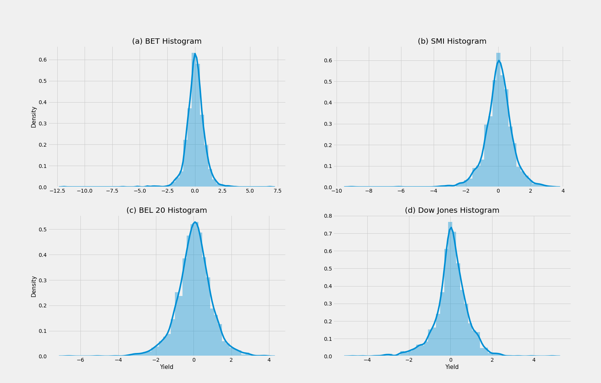

### Summary on indices

The BET index registered a decrease of 11.89% from one day to the next, being the largest decrease registered by all indices. BET is followed by SMI with a loss of 9%, BEL 20 with 6.61% and Dow Jones with 4.71%. In terms of the largest overnight increase, the BET index registered an increase of 6.81% followed by Dow Jones with 4.86%, BEL 20 with 3.80% and SMI with 3.36%. 

All indices have an asymmetric distribution on the left, with an asymmetry <0. In terms of flattening, the BET, SMI and Dow Jones indices have a leptocurtic distribution, and BET 20 has a mesocurtic distribution. The averages of the indices are similar, starting from Dow Jones with 0.0396% and BET with 0.0355% to SMI with 0.0279% and BEL 20 with 0.0266%.

## Event analysis

### BEL 20
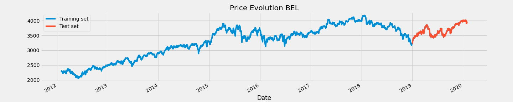
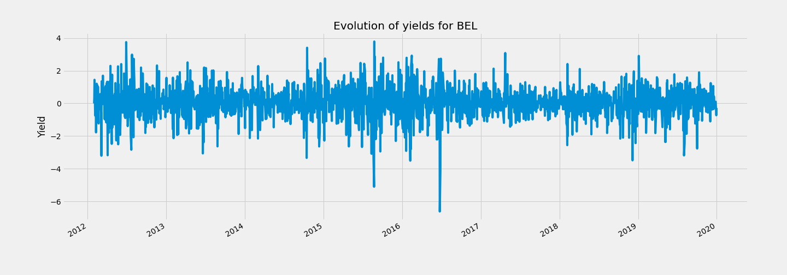

* June 29, 2012, 3.80% increase: European leaders manage to reach agreement on aid for troubled eurozone banks.
* October 17, 2014, increase of 3.47%: Benoît Coeuré, member of the executive board of the European Central Bank, announces that the central bank will start buying private sector debt instruments. At the same time, he says it is too early to talk about a possible German recession.
* August 24, 2015, 4.99% decrease: The decrease is caused by the sudden collapse of stocks in China and other Asian markets. Another factor is the possible slowdown in the Chinese economy and the low price for oil, which is hitting exporting countries and drilling companies hard.
* August 25, 2015, 3.87% increase: Concerns about the slowdown in the Chinese economy have eased, with China's central bank announcing a one-year decline in the bank lending rate to 4.6% from 4.85%.
* February 8, 2016, decrease of 3.45%: Amplification of fears about a slowdown in global economic growth and speculation about the possibility of a successful Brexit led to a rather large decrease.
* June 24, 2016 and June 27, 2016 with decreases of 6.40% and 4.06% respectively: The reaction of investors as a result of the Brexit result brought instability on the stock market for a longer period of time
* April 24, 2017, increase of 3.11%: The increase is determined by the results of the first round of the presidential elections in France. Another factor is the polls where it was expected that Emmanuel Macron would defeat Marine Le Pen in the second round.
* December 6, 2018, decrease of 3.42%: Tensions over a trade war between the US and China led to the sale of a very large number of shares.

### SMI

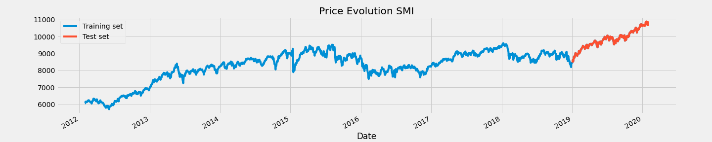
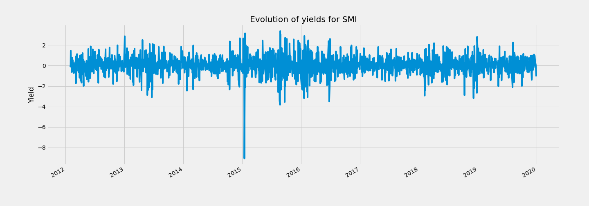

* January 15, 2015 and January 16, 2015 with decreases of 8.67%, respectively 5.96%: the National Bank of Switzerland announces that it will no longer keep the franc at a fixed exchange rate against the euro. At the same time, the interest rate decreased to -0.75%.
* 19 January 2015, increase of 3.21%: Speculation about the addition of incentives by the European Central Bank led to a large increase.
* August 21, 2015, decrease of 3.36%: Weak production in China exacerbated global economic fears, generating fear in investors.
* August 24, 2015, decrease of 3.75%: Sharp decrease in shares in China, as well as in other Asian markets. At the same time, another factor is the possible slowdown in the Chinese economy and the extremely low price for oil, which is hitting exporting countries and drilling companies hard.
* August 25, 2015, growth of 3.42%: Concerns about the slowdown in the Chinese economy have eased, with China's central bank announcing a one-year decrease in the bank lending rate to 4.6% from 4.85%.
* August 27, 2015, increase of 3.09%: the USA had much better financial results than expected.
* September 22, 2015, decrease of 3.49%: Volkswagen admits the manipulation of emission tests and manages to put car manufacturers under intense pressure.
* January 22, 2016, increase of 2.94%: Mario Draghi, former President of the European Central Bank in the period 2011-2019 suggests that additional stimulus measures could be implemented in March.
* June 24, 2016, decrease of 3.44%: Investor reaction as a result of the Brexit result.

### Dow Jones

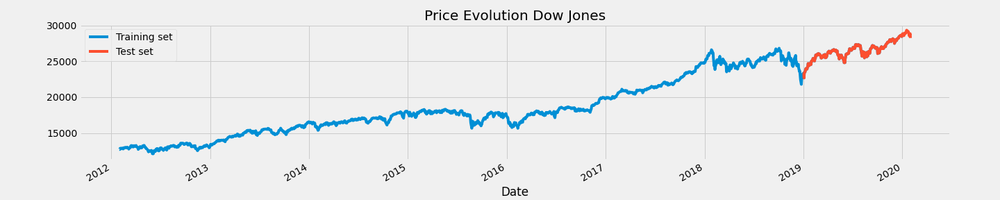
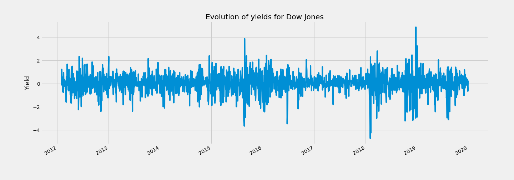

* August 24, 2015, 3.57% decline: Market correction, possible slowdown in China's economic growth and yuan devaluation led to a significant decline.
* August 26, 2015, increase of 3.95%: The index managed to recover after the sharp decline on August 24.
* June 24, 2016, decrease of 3.39%: Investor reaction as a result of the Brexit result.
* February 5, 2018, decrease of 4.6%: Decrease generated by the possibility of higher-than-expected inflation.
* February 8, 2018, decrease of 4.2%: The index underwent a market correction, growing too fast in too short a time.
* March 26, 2018, 2.84% increase: The increase is due to the imposition of tariffs worth $ 60 billion on imports from China.
* December 26, 2018, increase of 4.98%: The index recovered after the large loss on December 24 generated by low investor confidence.
* January 4, 2019, 3.29% increase: Growth generated by the announcement of the number of new jobs created in the US and by Jerome Powell's announcement indicating that the central bank was to be flexible with its monetary policies.

### BET

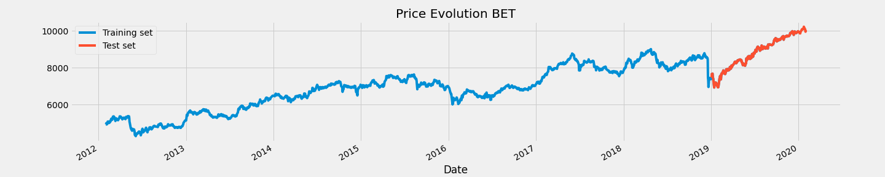
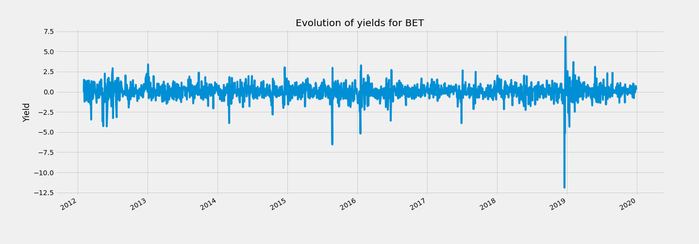

* January 3, 2013, increase of 3.47%: Extension of the trading program.
* August 24, 2015, decrease of 6.32%: The decrease is caused by the sudden collapse of stocks in China and other markets in Asia.
* January 18, 2016, decrease of 5.07%: The decrease of the oil price sent a negative feeling to the investors on the Romanian market as well.
* December 19, 2018 and December 21, 2018 with decreases of 11.21% and 5.06%, respectively: Introduction of new taxes for banks and for the telecom and energy sectors, as well as capping the gas price.
* December 24, 2018, increase of 7.05%: Recovery reaction as a result of the decrease on December 19 and 21, 2018, a decrease that was based on subjective factors.
* January 14, 2019, decrease of 4.23%: The appearance of some information regarding a possible change of the tax on banking assets, a tax that would have been calculated and paid quarterly instead of annually.
* February 4, 2019, growth of 3.75%: The good financial results of companies in 2018 led to a large increase.
* May 28, 2019, increase of 3.14%: The former president of PSD, Liviu Dragnea, is definitively convicted. The stock market is positively affected.

## Estimating the models

Finding a suitable model consists in adjusting the hyperparameters as best as possible in order to obtain accurate predictions. The optimal values of the hyperparameters are found and adjusted by evaluating the accuracy of the models on the test set by the mean square error.

The predictions are generated dynamically and will be based on a window size of 60, where each sequence helps to predict 15 values until it is changed. To predict the next 15 values, the sequence changes to 45 real values plus the previously generated predictions. At some point you will only get to use the predictions to generate new values. Dynamic forecasting also tells us if the model has overfitted on the train set.

In finding an optimal value for the size of the window, it was taken into account that it must not be too small to be able to capture dependencies in the longer term, but not too large to add noise in sequences, which would lead to an overfit model.

Within the LSTM and GRU models, a dropout layer set at 20% was included after each LSTM / GRU layer to prevent overfitting and a learning rate of 0.001. At the same time, a dense layer will be used to generate the outputs. To measure the accuracy, predictions will be made based on the test set.

### BEL 20

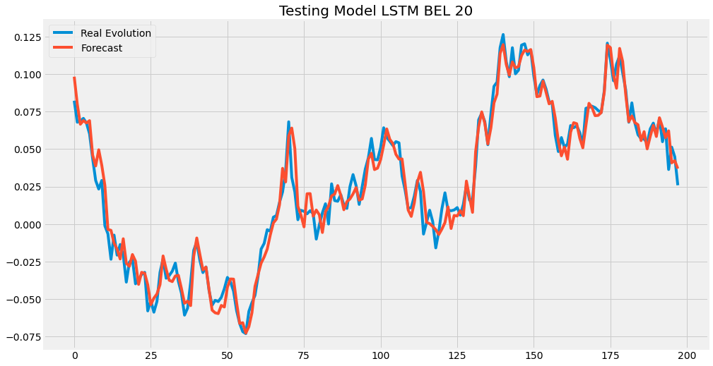

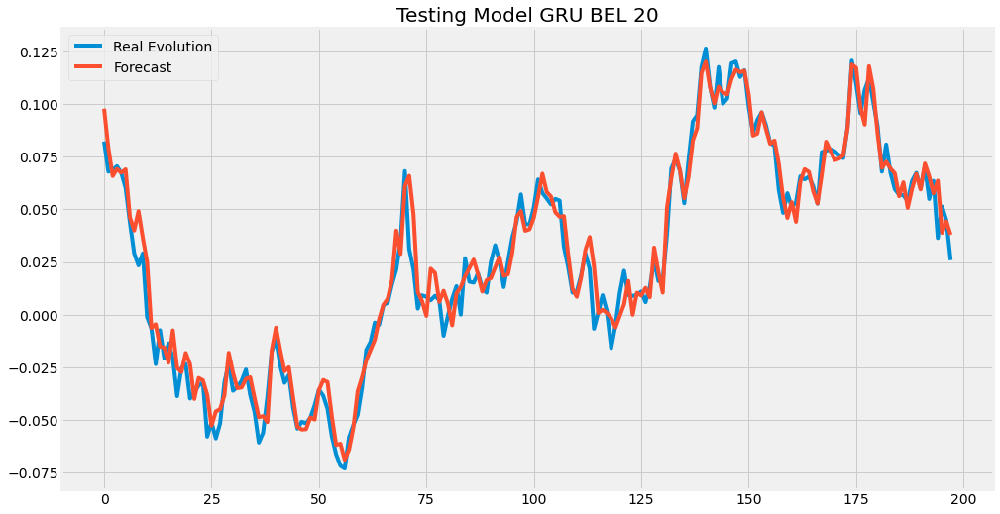

For the BEL 20 index, the found LSTM model has 4 LSTM layers with 60 neurons each. The model is run for 100 epochs with a learning rate of 0.001. The parameters are updated after every 128 observations. The model has a mean square error of 0.00007994.

Regarding the GRU model, it has 3 GRU layers with a number of neurons of 256, 256, respectively 64. It is run for 30 epochs with a learning rate of 0.001, and the parameters are updated after every 128 observations. Its MSE is 0.00008760. It can be seen that the models managed to capture quite well the properties of the test set.

### SMI

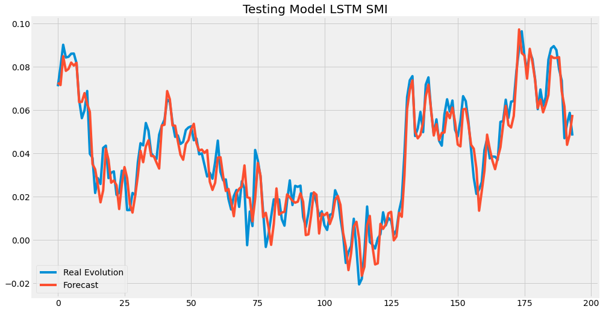
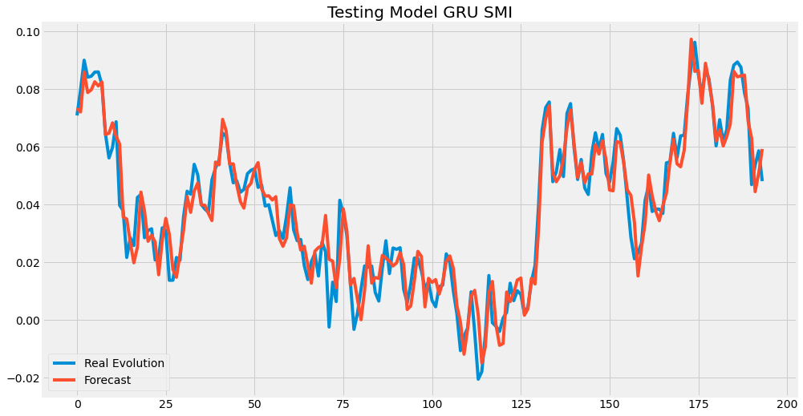

The LSTM model has 3 LSTM layers with a number of neurons of 256 for the first 2 layers and 64 for the 3rd. It is trained for 50 epochs, and for every 128 observations the parameters are updated.

The GRU model of the SMI index has 3 GRU layers with 60 neurons each and is trained for 50 epochs. The parameters are updated after every 128 observations.
The models have approximately the same square mean error, 0.00005249 for the LSTM model and 0.00005285 for the GRU model.

### BET

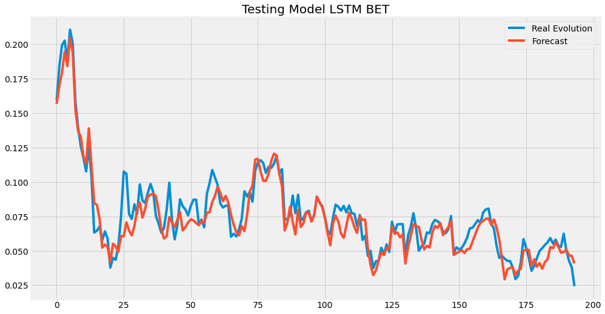
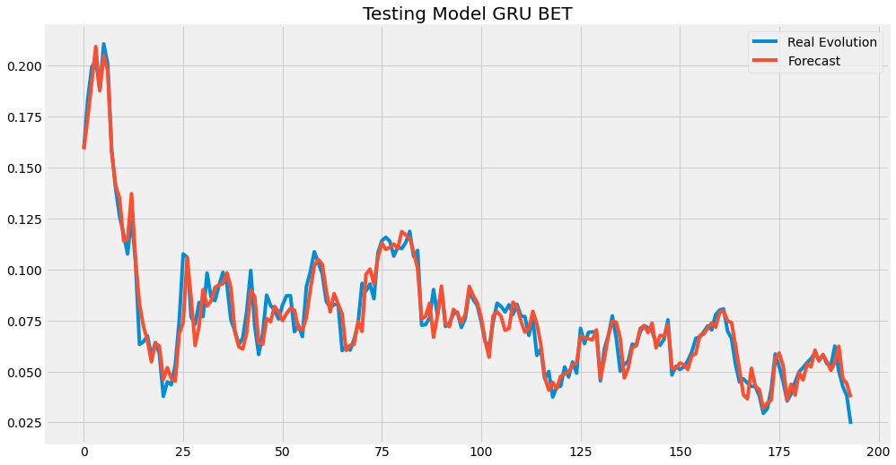

The LSTM model of the BET index has 4 LSTM layers with a number of neurons of 128 for the first 3 layers and 64 for the last LSTM layer. The GRU model has 4 GRU layers with a number of 60 neurons each. These are run for 70 epochs, respectively 30 epochs. For every 512 observations and 28 observations, respectively, the parameters are updated for the LSTM and GRU model. GRU has a mean square error of 0.00005736 compared to 0.00009880 in the case of LSTM.

### Dow Jones

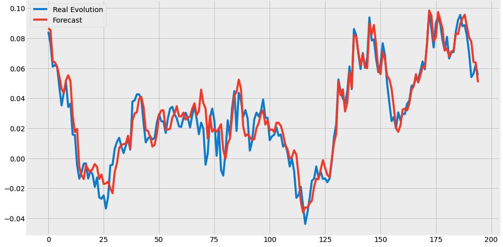
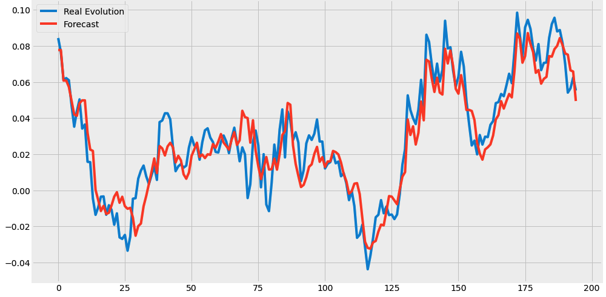

The LSTM model of the Dow Jones Industrial Average has 4 LSTM layers with a number of 60 neurons each. It is trained for 50 epochs, and the parameters are updated after every 256 observations.

In the case of the GRU model, it has 4 GRU layers with a number of neurons of 128 each. He is trained for 50 epochs, and for every 512 observations the parameters are updated. The LSTM model has a mean square error of 0.00008282 and the GRU of 0.0001022.

## Forecasts

### BEL 20

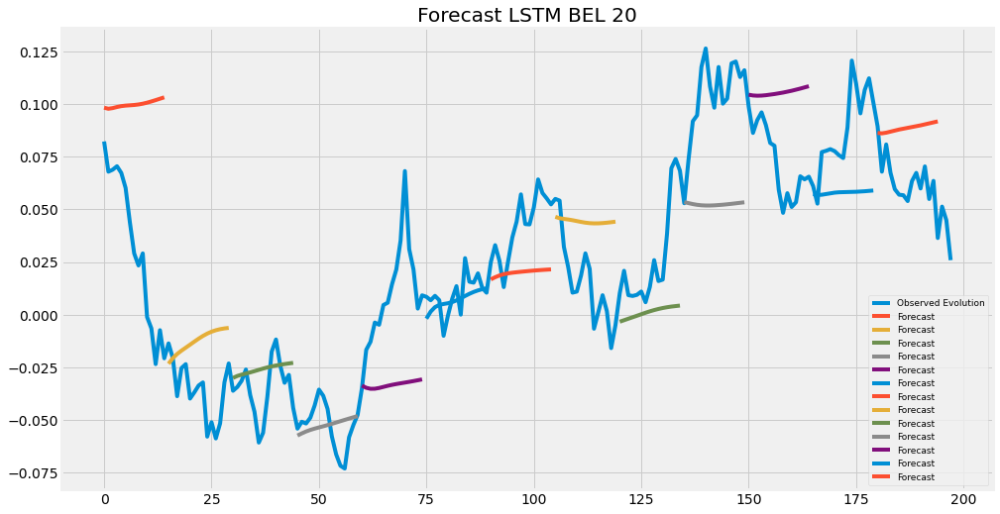
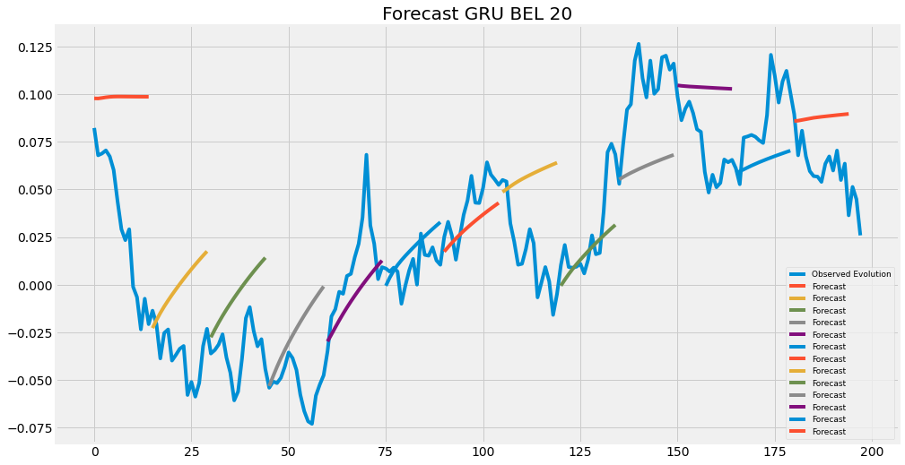

### SMI

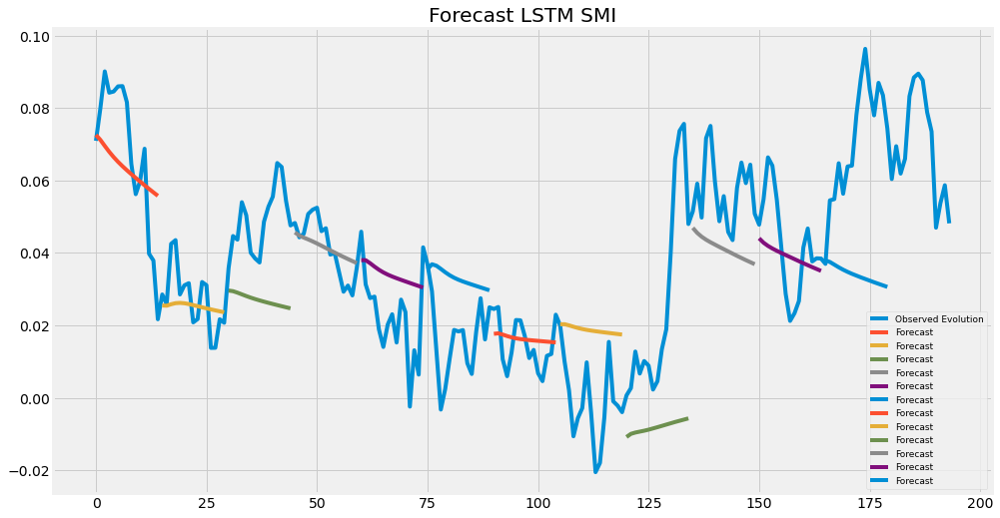
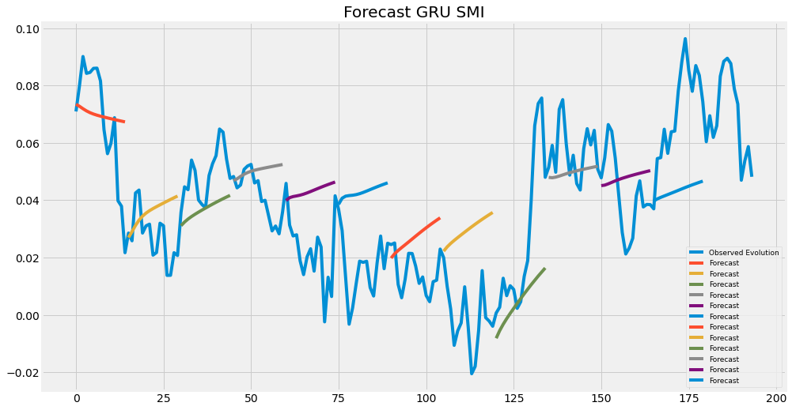

### BET

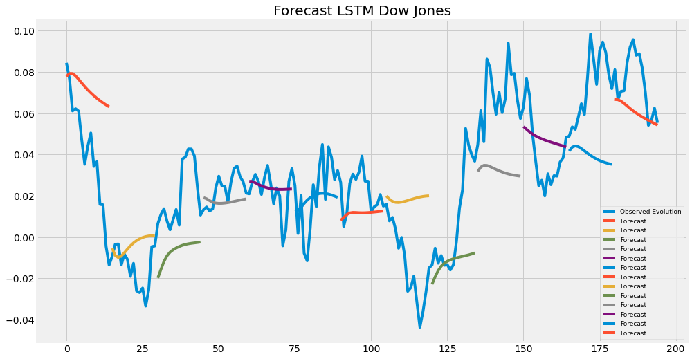
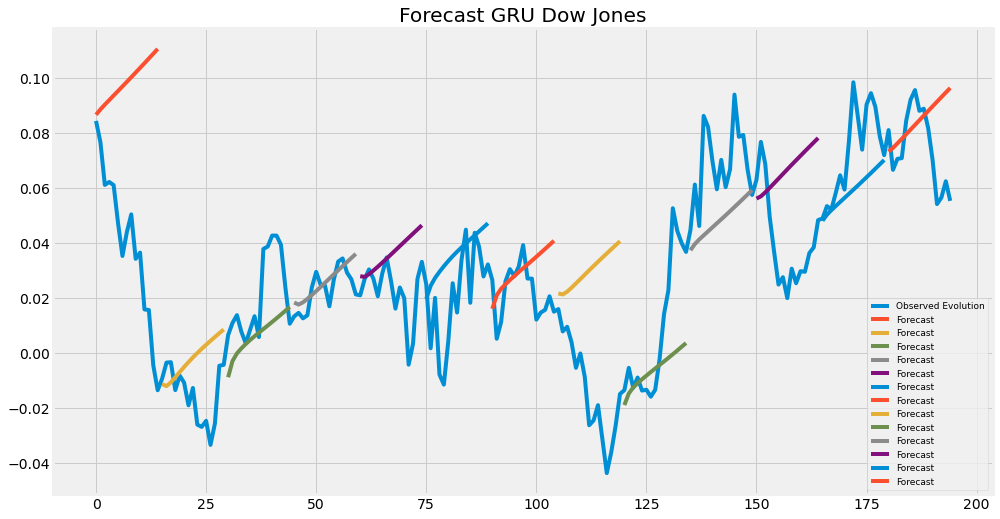

### Dow Jones

Analyzing the results of the forecasts for the BEL 20, BET, Dow Jones Industrial Average and SMI indices through the GRU and LSTM models, it was found that during the analyzed period the GRU model managed to predict the trend better for the BEL 20 and BET and LSTM indices Dow Jones and SMI indices. 

In the case of testing the models estimated on the test set, they managed to successfully capture the evolution and volatility. However, this was not reflected in the dynamic forecasting of the trend where the models failed to predict only in some cases the increase well, and in others the decrease. 

Despite the fact that the models were regularized by dropout, they could still suffer from overfitting. 

The most accurate trend forecasts were generated by the BET and BEL 20 index models. Although the Dow Jones index registered low volatility during the analysis, the forecasts failed to successfully capture increases and decreases. The most volatile index in the analysis, the BET index, managed to have the best forecasts. Even if the forecasts manage to be accurate at certain times, the forecasts of the LSTM and GRU models are not a sure way to invest money on the stock market.

## Conclusions

The scope of the project was aimed to analyze the evolution of the Dow Jones, SMI, BEL 20 and BET stock indices and to predict the trend that they will follow. The way to do this is by using two models based on the architecture of recurrent neural networks, LSTM and GRU. They were chosen because of their ability to account for long-term dependencies, which helps shape time sequences.

The analysis period is between 1 February 2012 and 31 January 2020. The data set is divided into an observation training set from 1 February 2012 to 31 December 2018 and a test set with observations from 1 January 2019 to 31 January 2020. Data were taken from Investing and transformed into yields in order to better analyze the events that led to sudden increases and decreases. Instead, for the model estimation and trend forecasting part, they were normalized.

  In the first part of the project it was discovered that the BEL 20, Dow Jones and SMI stock indices follow a leptocurtic distribution with left asymmetry, and the BET index a mesocurtic distribution with left asymmetry. It was also observed that the BET index had the largest variations from one day to the next. 

  The main causes that led to sudden increases and decreases during the analyzed period are political events such as Brexit or the presidential elections in France, as well as those related to inflationary fears, the emergence of a possible recession, the slowdown in global economic growth. Other events that had a significant impact included the US-China trade war, monetary policies adopted by some countries and the financial reports of stock market firms.

  In estimating the LSTM and GRU models, the loss is measured by MSE, and the hyperparameters have been optimized so as to reduce the MSE value as much as possible. 

  All models included a dropout layer set at 20% after each LSTM / GRU layer in order to avoid overfitting and a learning rate of 0.001. The model parameters were updated after a different number of observations depending on the model. Each sequence was composed of 60 values to predict the next value. In a first stage, the models were tested on the test set, and then dynamic predictions were generated for the entire test set with the sequence update every 15 predicted values.

  Even if the results of the models are good on the test set, the trend forecast showed that the models fail to be accurate in all cases. The most accurate results are those achieved on the BET index, and the weakest on the Dow Jones index.

  Due to the lack of precision of the models in predicting the trend, it can be concluded that forecasting only through the LSTM and GRU models is not a safe way to invest money on the stock market.
