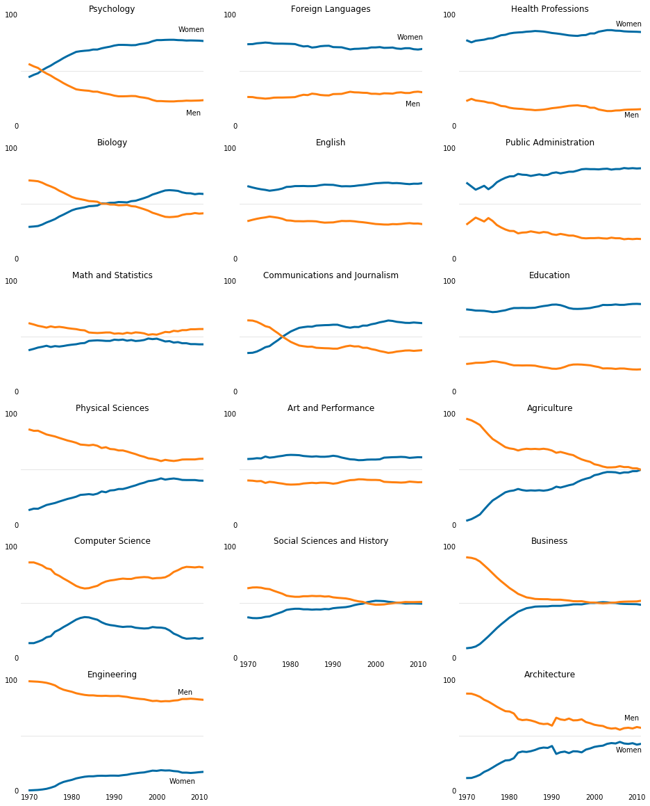

The scope of this project is to analyze the evolution of bachelor degrees gained by woman over time. The analysed period takes place between 1970 and 2012. 17 majors are disponible for our project : Agriculture, Architecture, Art and Performance, Biology, Business, Communications and Journalism, Computer Science, Education, Engineering, English, Foreign Language, Health Professions, Math and Statistics, Physical Sciences, Psychology, Public Administration and Social Sciences and History.

The data was made publicly available by The Department of Education Statistics which releases a data set annually containing the percentage of bachelor's degrees granted to women. The data is available on Randon Olson's website [here](http://www.randalolson.com/wp-content/uploads/percent-bachelors-degrees-women-usa.csv).

