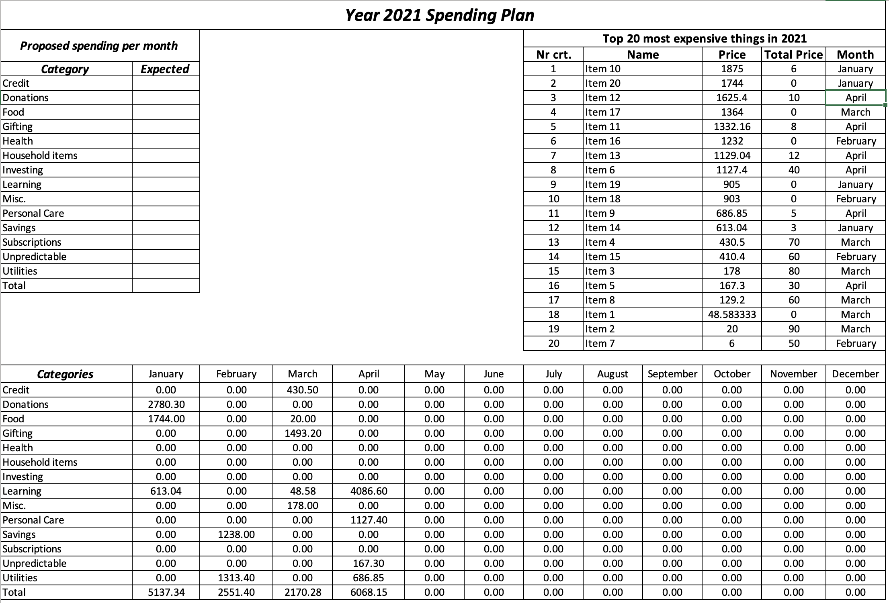
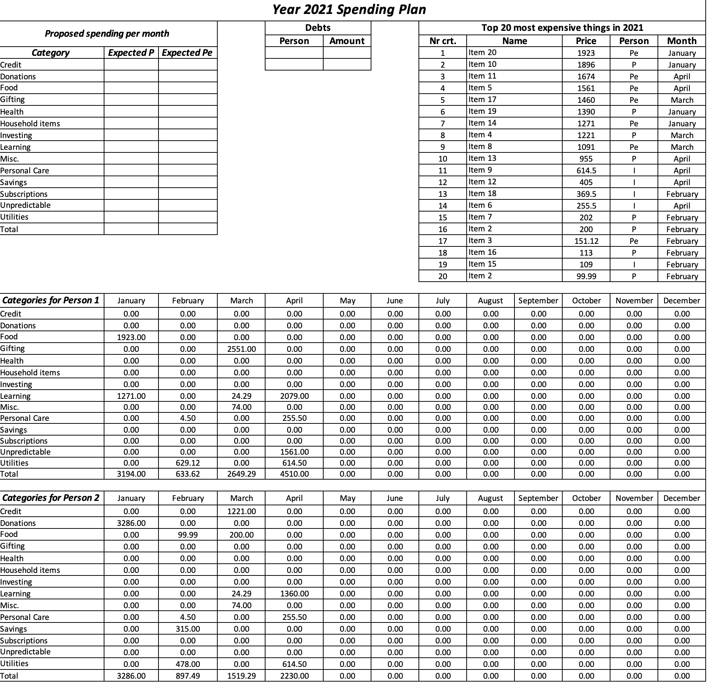
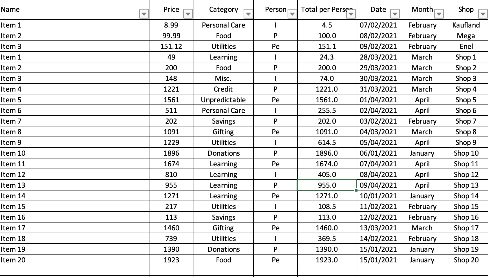

# These excel files provide a way to track the expenses in a easy way.

Some features it provides:

1. Easy to see dashboard with comparison to proposed spending
2. Year long tracking
3. Totals on each month
4. Sharing the cost
5. Automatic tracking of the 20 most expensive things
6. Multiple categories to choose from and easy ways to create new ones

Below you can find screenshots from the file:

Dashboard sheet:

The expenses sheet:

For easy data filling from invoices I would recommend something like [TextSniper](https://textsniper.app)

There is also a version designed for two persons:

In this version instead of the share feature you can choose the person who bought it or even split in 2 by typing "I" or in 3 by typing "B".
The costs which are split will be automatically added to the dashboard.

Dashboard sheet:

The expenses sheet:

