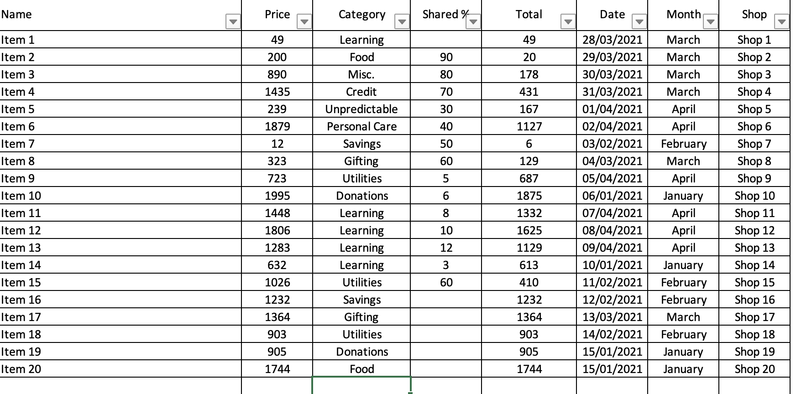

# This project consists in providing a way to track the expenses in a easy way.

Some features it provides:

1. Easy to see dashboard with comparison to proposed spending
2. Year long tracking
3. Totals on each month
4. Sharing the cost
5. Automatic tracking of the 20 most expensive things
6. Multiple categories to choose from and easy ways to create new ones

Below you can find screenshots from the file:

For easy data filling from invoices I would recommend something like [TextSniper](https://textsniper.app)
