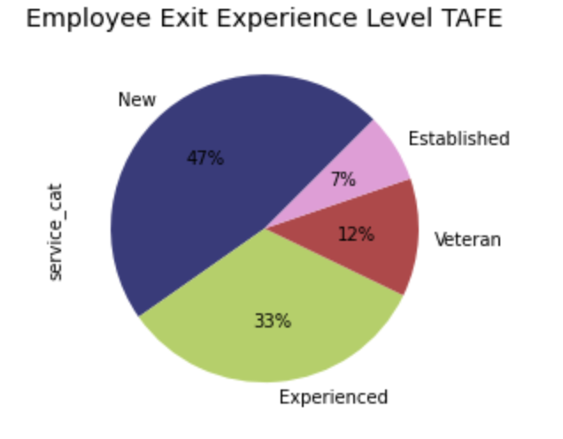
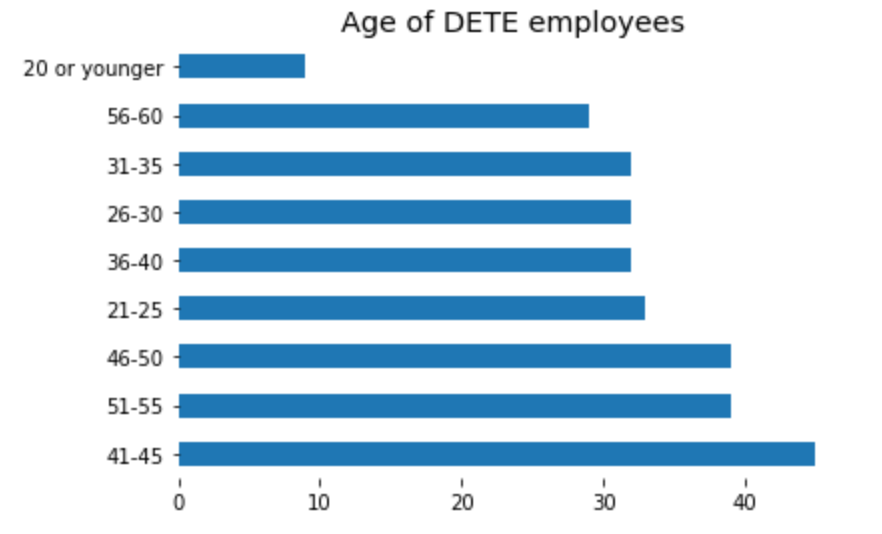
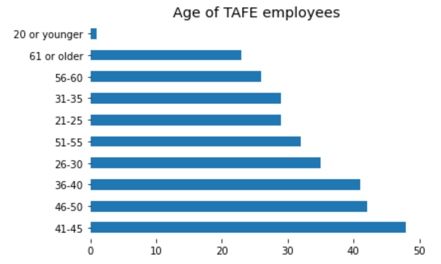
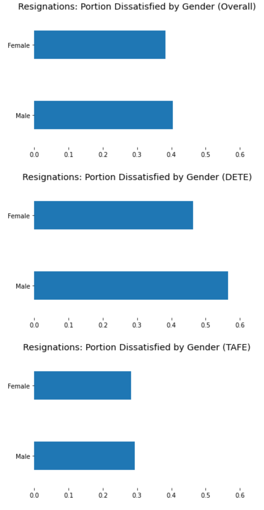
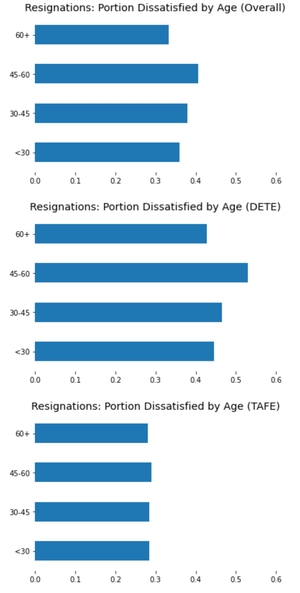

# Cleaning and Analyzing Employee Exit Surveys

---

In this project we will use the exit surveys from employees of the <b>Department of Education, Training and Employment (DETE)</b> and the <b>Technical and Further Education (TAFE)</b> institute in Queensland, Australia. The TAFE exit survey can be found __[here](https://data.gov.au/dataset/ds-qld-89970a3b-182b-41ea-aea2-6f9f17b5907e/details?q=exit%20survey)__ and the survey for the DETE __[here](https://data.gov.au/dataset/ds-qld-fe96ff30-d157-4a81-851d-215f2a0fe26d/details?q=exit%20survey)__ .

