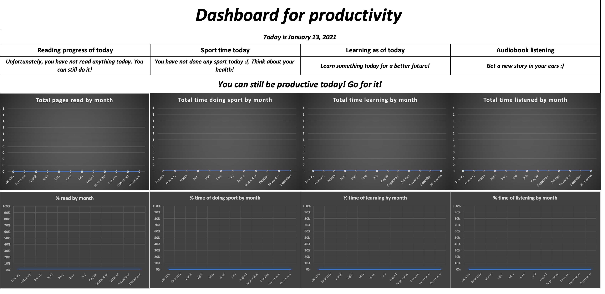
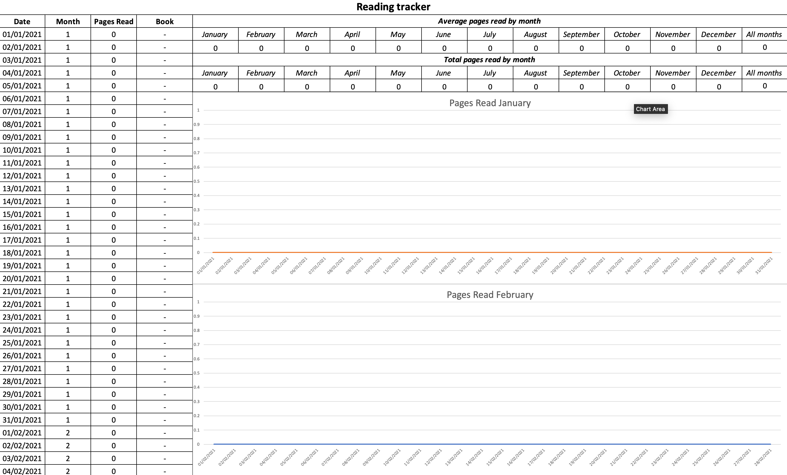
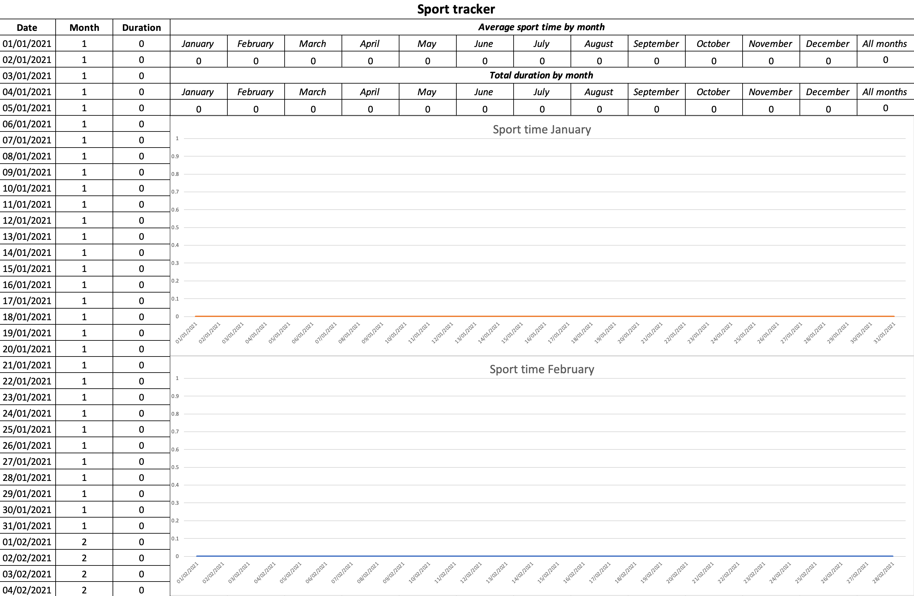
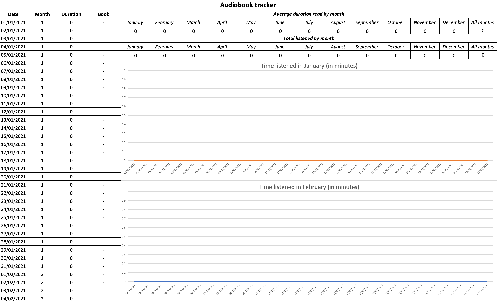

# Productivity Tracker template

Some features it provides:

1. Reading, Audiobook, Learning and Sport tracking
2. Averages per each month
3. Totals per each month
4. Visual plots for the time tracked in each month
5. Visual dashboard too se your daily and overall stats
6. Motivating quotes until you complete your daily target
7. A pivot sheet where you can see how many days you spent to finish a book.

Below you can find screenshots from the file:

Dashboard sheet:

Reading sheet:

Sport sheet:

Audiobook sheet:

Learning sheet:

