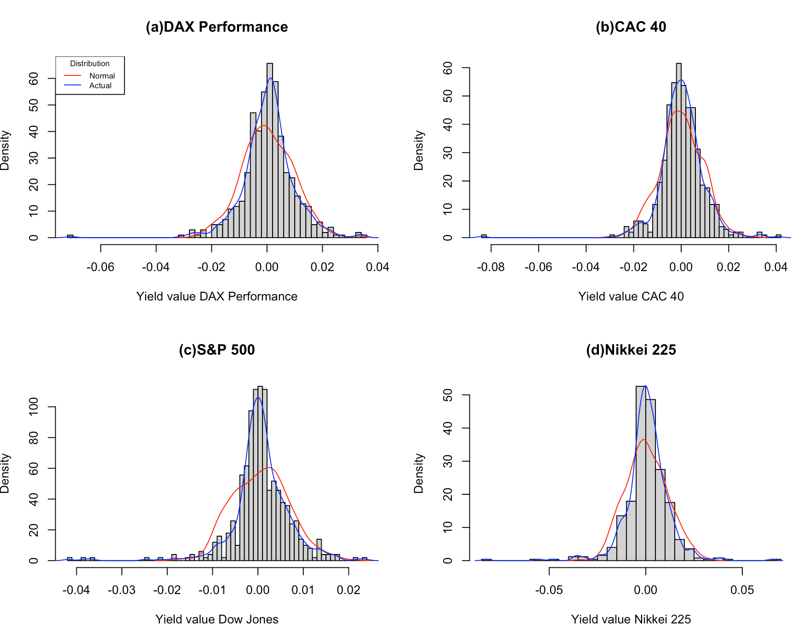
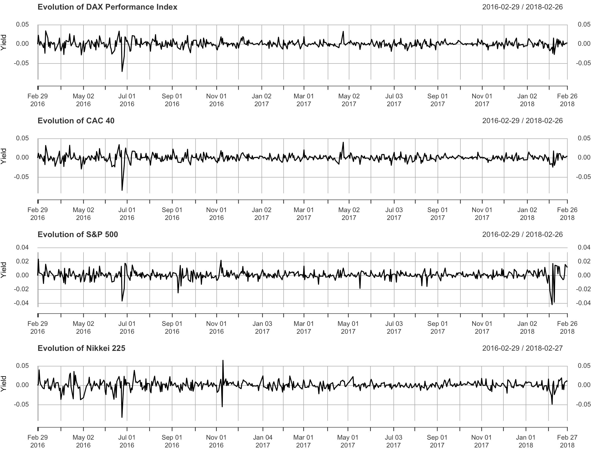
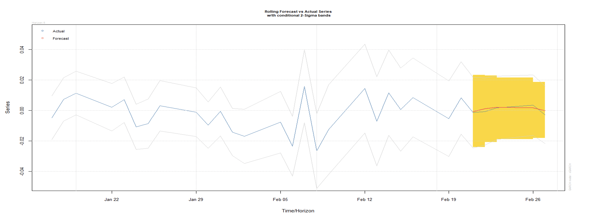
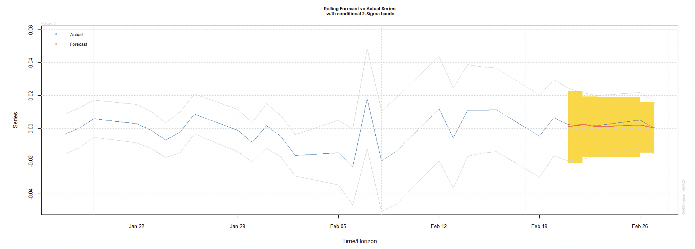
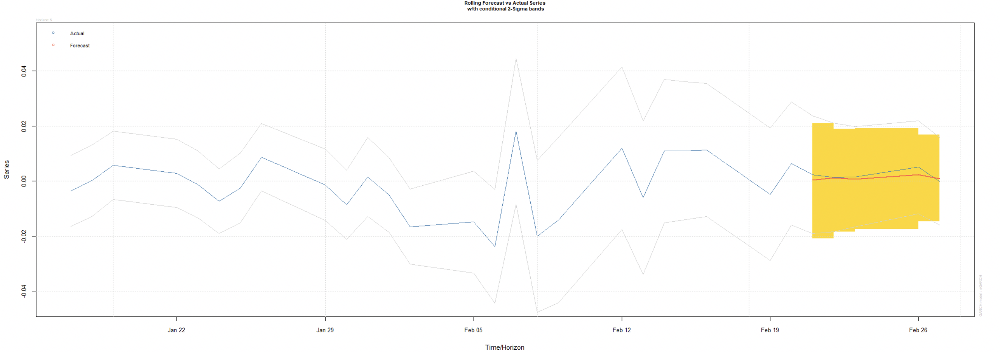
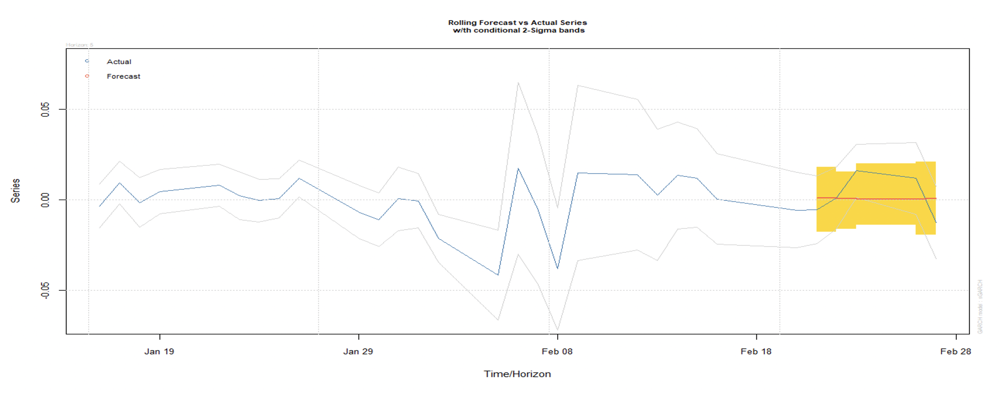
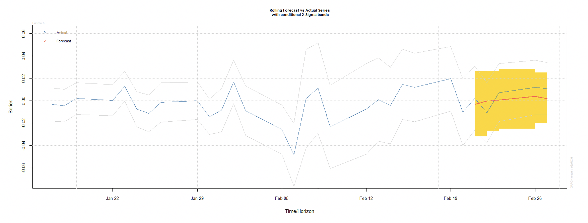
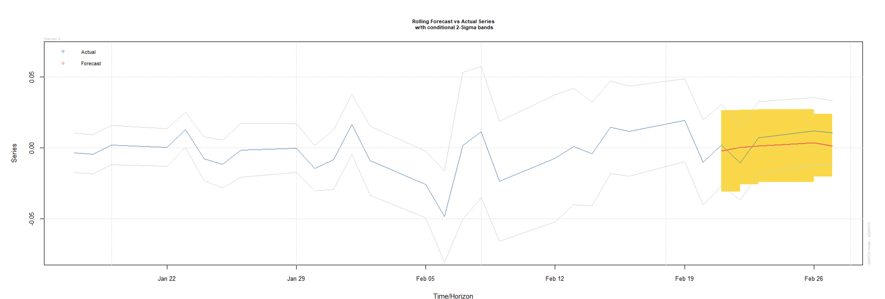

# Volatility modelling using ARMA-GARCH and ARMA-EGARCH

The scope of this project was to model the volatility of DAX Performance, CAC40, S&P 500, Nikkei 225 indices from Germany, France, USA and Japan in order to generate 5 day forecasts on their stability. The analysed takes place between 27.02.2016 - 27.02.2018. In the empiric analysis two types of hybrid models are used: ARMA-GARCH and ARMA-EGARCH. For the errors of the model we take into account different types of distributions: normal distribution, t-student, skew-student, skew-generalized error distribution, normal inverse gaussian distribution, generalized hyperbolic and Johnson's SU distribution.

The Forecasts are generated dynamically on a 5 day period and their accuracy is measured with mean squared error (MSE) and absolute mean error (MAE). It is also searched if the model with the lowest value of the Akaike criterion generates the best forecasts.

# Intro

The analysis is made on the yield of the stock indices because the closing prices are not comparable and their associated time series is often not stationary. 

The DAX Performance index, also known as Deutscher Aktienindex includes the 30 most important companies in Germany which are traded on Frankfurt stock market.
CAC 40 is the reference index of the France stock market and represents a weighted measure of the 40 most important companies traded on Euronext Paris.
Nikkei 225, also known as Nikkei Stock Average, is a weighted by price stock index which is traded on the Tokyo stock market.
S&P 500 or Standard & Poor's 500 is a stock index from the USA which is based on the stock market capitalization of 500 big companies which are listed on the New York and Nasdaq stock exchanges.

Looking at the evolution of the indices, it can be seen that the biggest decreases were recorded by the indices at the same time, at the end of July 2016 as a result of Brexit, result which sent shockwaves throughout the European Union. The fluctuations from the beginning of november 2016, which are more noticeable for S&P 500 and Nikkei 225 can be assigned to the USA presidential elections. The biggest increases for indices in Europe, CAC 40 and DAX Performance, from March 2016 can be assigned to a comeback after a decrease caused by the oil price which has decreased a lot. The increases from 27 april 2017 for the Europe indices are resulted from the France presidential election, where Emmanuel Macron has won. The last commun fluctuation was caused by fears of inflation which sent shockwaves throughout the world. 

# Estimating the ARMA models, testing the autocorrelation and the heteroskedasticity

In order to find the parameters of the Autoregressive model (AR) and the Moving Average model (MA), multiple models are estimated with different values for the order of AR and MA. The model will be chosen based on the informational criterion Akaike (AIC). The model with the samllest value will be chosen as the best. 

We will take as an example for the next steps the DAX index:

| Model         | AIC value     |
| ------------- |:-------------:| 
| ARMA(1,0)     | -3319.38|
| ARMA(1,1)     |   -3317.38    |
| ARMA(1,2)     | 	-3315.38    |
|ARMA(2,1)     |	-3320.07 |
|ARMA(2,2)	|-3323.25 |
|ARMA(2,3)	|-3320.55 |
|ARMA(3,3)	|**-3330.71** |

Going through the previous table, we can see that the best model for DAX would be an ARMA(3,3). 
The next step which we need to take is to check for the presence of autocorrelation and heteroskedasticity in the residuals of the ARMA model. The presence of autocorrelation is determined using the Ljung-Box test and the ARCH-LM test for the presence of heteroskedasticity.	

| Index         | Q(10)         | p-value | Q(15) | p-value| Q(20) | p-value|
| ------------- |:-------------:| -----:| ------:| ------:| ------:| ------:|
| DAX	        | 47.493	| 0.000 | 51.588 | 0.000  | 53.172 | 0.000

| Index        | χ^2       | p-value |
| ------------- |:-------------:| -----:|
| DAX	        | 41.007	| 0.000 |

The autocorrelation is confirmed by the values from the Ljung-Box test where the null hypothesis (H0: residuals are independent) is rejected. The heteroskedasticity is confirmed by the ARCH-LM where the null hypothesis is also rejected (H0: residuals are homoskedastic).

Obtaining this information, we can now model the volatility with the help of GARCH(1,1) and EGARCH(1,1). 

# Estimating ARMA-GARCH and ARMA-EGARCH, checking residuals and choosing the adequate model

In this chapter, GARCH(1,1) and EGARCH(1,1) models will be estimated using multiple different distribution errors. In order to compare the forecasts with real data, we will leave the last 5 observations outside of the sample for each model. When choosing the most adequate models, the information criterion Akaike will be used. At the same, the forecasts for each model is compared using MSE and MAE. The validity of the model is afterwards checked by checking the standardised residuals in order to test if the autocorrelation is eliminated from the residuals and if they are homoskedastic.

| Model         | AIC.          | MSE   |   MAE | 
| ------------- |:-------------:| -----:| ------:|
|GARCH-NORM	|-6.6888	|0.000003861	|0.001687|
|GARCH-STD	|-6.7154	|0.000007018	|0.002495|
|GARCH-GED	|-6.7182	|0.000006123	|0.002381|
|GARCH-SSTD	|-6.7126	|0.000006849	|0.002474|
|GARCH-NIG	|-6.7190	|**0.000002977**|**0.001473**|
|GARCH-GHYP	|-6.7122	|0.000006066	|0.002121|
|GARCH-SGED	|-6.7150	|0.000005728	|0.002093|
|EGARCH-NORM	|-6.6816	|0.000005650	|0.001994|
|EGARCH-STD	|**-6.7882**	|0.000008711	|0.002549|
|EGARCH-GED	|-6.7654	|0.000006977	|0.002437|
|EGARCH-SSTD	|-6.7646	|0.000005613	|0.002241|
|EGARCH-NIG	|-6.7700	|0.000006897	|0.002442|
|EGARCH-GHYP	|-6.7607	|0.000005602	|0.002229|
|EGARCH-SGED	|-6.7660	|0.000007001	|0.002487|

It seems that for the DAX index, the model which forecasts the best on a 5 day period is the ARMA(3,3)-GARCH(1,1) with a normal inverse distribution. If we look at AIC that model would be ARMA(3,3)-EGARCH(1,1) with a t-student distribution. Based on the above table, using a different distribution for the errors for the GARCH model, influences pretty much the forecasts. 

| Parameter      | DAX NIG  |
| ------------- |:-------------:| 
|μ              | 0.0006* |
|ϕ_1            | -0.0449*** |
|ϕ_2            | -0.1238*** |
|ϕ_3            | -0.9313*** |
|ϕ_4            | -       |
|θ_1            | 0.0491***  |
|θ_2            | 0.1569*** |
|θ_3            | 0.9338*** |
|θ_4            | -      |
|α_0            | 0.0000 |
|α_1            | 0.1038*** |
|β_1            | 0.8814***|
|Shape          | 0.8694***|
|Skew           | 0.0335|

In the above table, μ and α_0 are constants for the ARMA model and the GARCH model. ϕ_1, ϕ_2, ϕ_3, ϕ_4 belong to the Autoregressive model (AR) and θ_1, θ_2, θ_3, θ_4 to the MA model. α_1 and β_1 belong to the GARCH model while Skew and Shape are used for the different distributions of the models. 
It can be seen that α_1 and β_1 are statistically significant and their sum being close to 1 tells us that the volatility remains over a longer period of time decreasing slowly. The EGARCH model is an asymetric model which quantifies differently the positive and negative shocks, unlike GARCH which considers positive and negative shocks as having the same impact on the conditional variance.  

| Index         | Model |Q(10)         | p-value | Q(15) | p-value| Q(20) | p-value|
| ------------- |:-------------:| -----:| ------:| ------:| ------:| ------:|------:|
| DAX	        | GARCH-NIG | 4.9129	| 0.8969 | 6.6273 | 0.9672  | 8.2529 | 0.9901

Applying the Ljung-Box over the standardised squared residuals, it can be concluded that they are independent (H0 is accepted).

| Model        |  χ^2      | p-value |
| ------------- |:-------------:| -----:|
| DAX	GARCH-NIG        | 5.6100	| 0.8469 |

After applying ARCH-LM test, the null hypothesis is accepted and we can conlude that the standardised residuals are homoskedastic.

Therefore, our models are valid and it is not needed to search for other ones.

## DAX Forecast

Above, the 5 day forecast can be seen for the model ARMA(3,3) - GARCH(1,1) with an normal inverse distribution for the DAX Performance Index.

| Day      | Observed Yield      | ARMA(3,3) GARCH(1,1) NIG |
| ------------- |:-------------:| -----:|
|21.02.2018	|-0.0013951348	|-0.000758114|
|22.02.2018	|-0.0006882673	|0.001238773|
|23.02.2018	|0.0017542012	|0.002090414|
|26.02.2018	|0.0034585052	|0.001809072|
|27.02.2018	|-0.0029027043	|-0.000085618|

In the case of Dax Performance, the model can follow the volatility pretty well despite the fluctuations from February which came as a negative reaction following the big decreases registered at the beginning of the month by the Dow Jones Industrial Average Index in the USA.

## CAC 40 Forecast

In the two images above, the forecasts seen are done by the models with the best MSE value ARMA(4,4)-GARCH(1,1) with a skewed t-student distribution and the model with lowest MAE ARMA(4,4)-GARCH(1,1) with a normal distribution.

| Day      | Observed Yield      | ARMA(4,4) GARCH(1,1) SSTD | ARMA(4,4) GARCH(1,1) NORM|
| ------------- |:-------------:| -----:|-----:|
|21.02.2018	|0.002324401	|0.000393999	|0.000823684|
|22.02.2018	|0.001330656	|0.001243856	|0.002395434|
|23.02.2018	|0.001532031	|0.000749157	|0.000842025|
|26.02.2018	|0.005044202	|0.002247129	|0.001998859|
|27.02.2018	|-0.000061673	|0.000877447	|0.000081398|

As in the case of DAX Performance, the models of the CAC 40 index manage to generate accurate forecasts over the 5 day period despite the same type of fluctuation generated by the Dow Jones Industrial Average index.
## S&P 500 Forecast

For the S&P 500 index, we can see the forecasts done by the model ARMA(1,1)-GARCH(1,1) with a skewed t-student distribution.
| Day      | Observed Yield      | ARMA(1,1) GARCH(1,1) SSTD |
| ------------- |:-------------:| -----:|
|21.02.2018	|-0.0055116646	|0.000954799|
|22.02.2018	|0.0009730776	|0.000856578|
|23.02.2018	|0.0159012783	|0.000698969|
|26.02.2018	|0.0116884387	|0.000273557|
|27.02.2018	|-0.0127883222	|0.000822942|

The considerable difference between the forecasted value and the real value of the yield of the S&P index was caused by wave of unstability in the stock market in the USA.

## Nikkei 225 Forecast

In the two pictures above, we have the model ARMA(3,3)-GARCH(1,1) with a normal distribution which generated the best MAE value and in the second one we have the model with best MSE, ARMA(3,3)-GARCH(1,1) with a generalized error distribution.
| Day      | Observed Yield      | ARMA(3,3) GARCH(1,1) NORM | ARMA(3,3) GARCH(1,1) GED|
| ------------- |:-------------:| -----:|-----:|
|21.02.2018	|0.0020826	|-0.0217247	|-0.0034468|
|22.02.2018	|-0.0107246	|0.0003381	|-0.0003114|
|23.02.2018	|0.0071667	|0.0012975	|0.0006695|
|26.02.2018	|0.0118445	|0.0034557	|0.0039466|
|27.02.2018	|0.0106067	|0.0012539	|0.0017038|

In the case of the Nikkei 225 index, the model has managed to capture most of the fluctuation of the index generated by the sudden decreases of Dow Jones at the beginning of the Month.

The fluctuations of the Nikkei 225 index seem to be higher than those of the European indices, Dax Performance and CAC 40. 

## Forecast conclusions

Comparing all the forecasts, we can conclude that the best forecasts were obtained from Europe for the CAC 40 and DAX Peformances indices, followed by Nikkei 225 from Japan and S&P 500 from SUA.

Analysing the yield of the stock indices DAX Performance, CAC 40, S&P 500 and Nikkei 225 over the period 27.02.2016-27.02.2018 it was discovered that the symetric GARCH models offer better results than the asymetric EGARCH model. 

The forecasts of the indices were influenced by the high volatility from the Dow Jones Industrial Average index at the beginning of the month of February. 

As we've seen, the ARMA-GARCH models can learn the volatility of the stock indices pretty well and can generate short term forecasts which can be close to realty in the case that no high volatility events occur. However, in order to get the best forecasts, it is necessary to take into account different distributions of error for the GARCH and EGARCH models and to ignore the information criterion AIC because it doesn't give the best forecasting model. 

